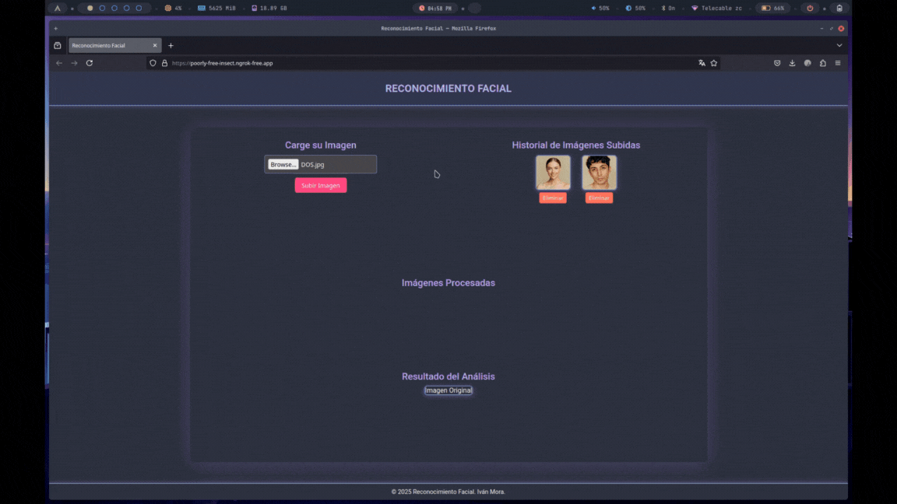

# Deteccion de Emociones



Sistema de deteccion de emociones faciales y puntos clave del rostro a partir de imagenes. Desarrollado con Python, Flask, TensorFlow y OpenCV.

## Descripcion

La aplicacion recibe una imagen a traves de una interfaz web, detecta el rostro presente en ella y realiza dos tareas de forma simultanea:

- Localiza puntos clave del rostro (keypoints) usando una red neuronal convolucional basada en ResNet.
- Clasifica la emocion predominante entre siete categorias: enojado, asco, miedo, feliz, triste, sorpresa y neutral.

El resultado se muestra como un conjunto de imagenes procesadas que incluyen la imagen original anotada con los puntos faciales y la emocion detectada, junto con variaciones (rotacion, espejo y ajuste de brillo).

## Estructura del proyecto

```
app.py                    Servidor Flask y rutas de la API
utils.py                  Logica de procesamiento de imagenes y prediccion
train_emotions_model.py   Script para entrenar el modelo de emociones
train_keypoints_model.py  Script para entrenar el modelo de puntos faciales
download_fer_dataset.py   Script para descargar el dataset FER
models/                   Arquitecturas y pesos de los modelos entrenados
templates/                Plantilla HTML de la interfaz web
static/                   Archivos CSS y JS del frontend
recursos/                 Recursos adicionales e imagenes de ejemplo
requirements.txt          Dependencias del proyecto
```

## Requisitos

- Python 3.8 o superior
- Las dependencias listadas en `requirements.txt`

Instalar dependencias:

```bash
pip install -r requirements.txt
```

## Modelos

El sistema utiliza dos modelos entrenados que deben estar en la carpeta `models/`:

- `weights_keypoint.keras` — deteccion de 15 puntos faciales (30 coordenadas)
- `weights_emotions.keras` — clasificacion de 7 emociones

Para entrenar los modelos desde cero, primero descarga los datasets y luego ejecuta los scripts de entrenamiento:

```bash
# Descargar dataset FER para emociones
python download_fer_dataset.py

# Entrenar modelo de puntos faciales (requiere DataSets/training.csv de Kaggle)
python train_keypoints_model.py

# Entrenar modelo de emociones (requiere DataSets/archive/ con imagenes por carpeta)
python train_emotions_model.py
```

## Uso

Iniciar el servidor:

```bash
python app.py
```

La aplicacion quedara disponible en `http://localhost:5000`. Desde la interfaz web se puede subir una imagen para obtener el analisis de emociones y puntos faciales.

El servidor tambien inicia ngrok automaticamente para exponer el servicio de forma publica. La URL publica se muestra en la consola al arrancar.

## API

| Metodo | Ruta | Descripcion |
|--------|------|-------------|
| GET | `/` | Interfaz web principal |
| POST | `/upload` | Sube una imagen y devuelve las imagenes procesadas |
| POST | `/reprocesar` | Reprocesa una imagen ya subida |
| POST | `/eliminar_imagen` | Elimina una imagen del historial |
| GET | `/historico_imagenes` | Lista las imagenes subidas |
